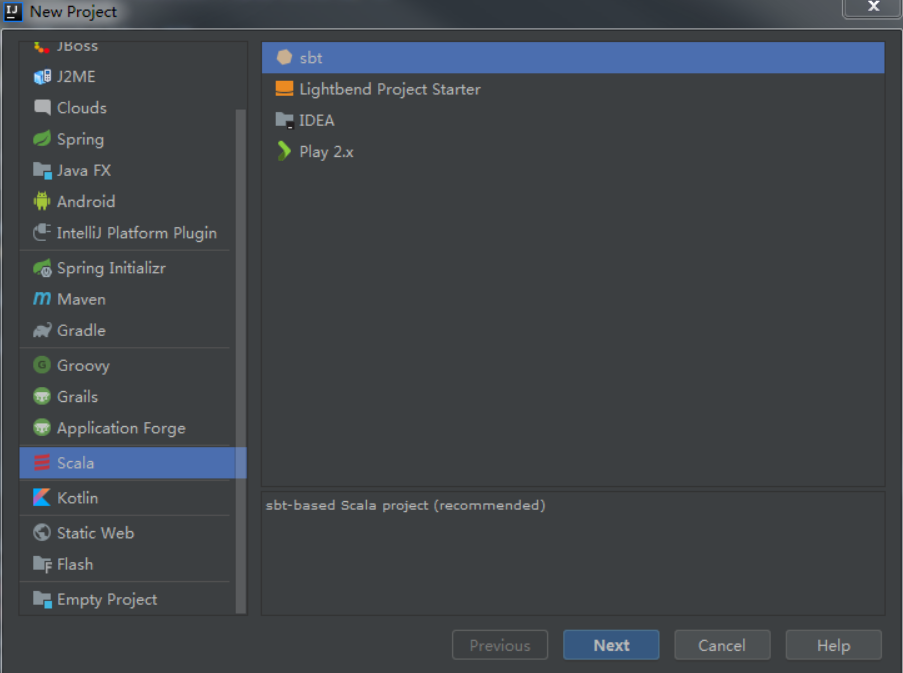

# 第一章 相关环境设置

## 1、安装Java开发环境

### 下载JAVA

进入官网下载地址

* [https://www.oracle.com/technetwork/java/javase/downloads/jdk8-downloads-2133151.html](https://www.oracle.com/technetwork/java/javase/downloads/jdk8-downloads-2133151.html)
* 下载最新版本的jdk-xxxx-linux-x64.tar.gz安装包

### 安装Java

将下载的安装包拷贝到想要安装的目录

```scala
// 解压安装包
tar -xzvf jdk-8u241-linux-x64.tar.gz

// 修改环境变量
vim ~/.bashrc

// 在环境变量文件最末添加
export JAVA_HOME=/home/soft/jdk1.8.0_241
export CLASSPATH=.:$JAVA_HOME/lib/dt.jar:$JAVA_HOME/lib/tools.jar
export PATH=$JAVA_HOME/bin:$JAVA_HOME/jre/bin:$PATH:$HOME/bin

// 保存退出后生效设置
source ~/.bashrc

// 查看是否安装成功
java -version
```

## 2、安装SBT工具

进入官网下载

* [https://www.scala-sbt.org/download.html](https://www.scala-sbt.org/download.html)
* 下载最新sbt-x.x.x.tgz安装包

将下载的安装包移动到安装java包的目录

```scala
// 解压安装包
tar zxvf sbt-x.x.x.tgz

// 在安装目录创建sbt文件
vim sbt

// 在sbt中添加如下代码
#!/bin/bash
BT_OPTS="-Xms2048M -Xmx4096M -Xss1M -XX:+CMSClassUnloadingEnabled -XX:MaxPermSize=256M"
java $SBT_OPTS -jar /home/soft/sbt/bin/sbt-launch.jar "$@"
// *注意更改/home/soft/为你的安装目录*
 
// 修改sbt文件权限
chmod u+x sbt

// 配置sbt环境变量
vim /etc/profile
// *在末尾添加*
export SBT_HOME=/home/soft/sbt
export PATH=${SBT_HOME}/bin:$PATH
// *注意更改/home/soft/为你的安装目录*

// 生效配置
source /etc/profile

// 检测是否安装成功
sbt -version

```

## 3、安装Chisel开发软件

安装前说明：Java一定要安装成功

### intellij下载

* [https://www.jetbrains.com/idea/download](https://www.jetbrains.com/idea/download)

```scala
// 安装intellij
// 在sudo环境下安装
tar -xf ideaIU-2017.3.4-no-jdk.tar.gz
mv idea-IU-173.4548.28 /opt
cd /opt/idea-IU-173.4548.28/bin

// 运行intellij
./idea.sh

// *注意修改自己的版本号和安装地址*
```

### 安装Scala支持

随意建立一个工程，创建完毕后选择File -&gt; Setting，选择选项卡中的Plugins，搜索Scala，安装人气最高的那个插件，等安装完后重启intelij。

请自行测试是否能运行scala文件，既编写hello world测试。

### 安装Chisel支持




```scala
// 打开左侧project中的build.sbt
// 替换为如下代码
def scalacOptionsVersion(scalaVersion: String): Seq[String] = {
  Seq() ++ {
    // If we're building with Scala > 2.11, enable the compile option
    //  switch to support our anonymous Bundle definitions:
    //  https://github.com/scala/bug/issues/10047
    CrossVersion.partialVersion(scalaVersion) match {
      case Some((2, scalaMajor: Long)) if scalaMajor < 12 => Seq()
      case _ => Seq("-Xsource:2.11")
    }
  }
}

def javacOptionsVersion(scalaVersion: String): Seq[String] = {
  Seq() ++ {
    // Scala 2.12 requires Java 8. We continue to generate
    //  Java 7 compatible code for Scala 2.11
    //  for compatibility with old clients.
    CrossVersion.partialVersion(scalaVersion) match {
      case Some((2, scalaMajor: Long)) if scalaMajor < 12 =>
        Seq("-source", "1.7", "-target", "1.7")
      case _ =>
        Seq("-source", "1.8", "-target", "1.8")
    }
  }
}


name := "c_t_1" // 工程名自行更改

version := "0.1" // 版本参考未替换前

scalaVersion := "2.11.12" // 参考自己安装的Scala版本

crossScalaVersions := Seq("2.11.12", "2.12.4")

resolvers ++= Seq(
  Resolver.sonatypeRepo("snapshots"),
  Resolver.sonatypeRepo("releases")
)

// Provide a managed dependency on X if -DXVersion="" is supplied on the command line.
val defaultVersions = Map(
  "chisel3" -> "3.2-SNAPSHOT",
  "chisel-iotesters" -> "1.3-SNAPSHOT"
)

libraryDependencies ++= Seq("chisel3","chisel-iotesters").map {
  dep: String => "edu.berkeley.cs" %% dep % sys.props.getOrElse(dep + "Version", defaultVersions(dep)) }

scalacOptions ++= scalacOptionsVersion(scalaVersion.value)

javacOptions ++= javacOptionsVersion(scalaVersion.value)

// 配置完后保存，软件自动开始下载所需要的依赖
// 下载依赖需要访问外放，请自动选择相关操作
```

依赖和配置成功后就可以编写Chisel代码了

## 4、RISCV交叉编译链

安装过程参考

* [https://moon548834.github.io/cyc10-rcore-tutorial/Chap1/1-0-environment.html\#riscv%E4%BA%A4%E5%8F%89%E7%BC%96%E8%AF%91%E9%93%BE](https://moon548834.github.io/cyc10-rcore-tutorial/Chap1/1-0-environment.html#riscv%E4%BA%A4%E5%8F%89%E7%BC%96%E8%AF%91%E9%93%BE)

安装命令

```scala
sudo apt-get install autoconf automake autotools-dev curl libmpc-dev libmpfr-dev libgmp-dev gawk build-essential bison flex texinfo gperf libtool patchutils bc zlib1g-dev libexpat-dev
git clone --recursive https://github.com/riscv/riscv-gnu-toolchain
cd riscv-gnu-toolchain
./configure --prefix=/opt/riscv --with-arch=rv32ima --with-abi=ilp32
make -j4

// *从Github仓库获得安装链需要好网络，谨慎操作*
// *make需要花费大量时间，耐心等待*
// *更详细的参数请参考 https://github.com/riscv/riscv-gnu-toolchain 的说明*
```

```scala
// 添加环境配置
~/.bashrc
PATH=/opt/riscv/bin:$PATH
source ~/.bashrc
```

## 5、Quartus安装

下载Quartus安装包

* [https://fpgasoftware.intel.com/?edition=lite](https://fpgasoftware.intel.com/?edition=lite)


下载安装完成后即可打开代码仓库中的Quartus工程

* [https://github.com/oscourse-tsinghua/undergraduate-hqing2020](https://github.com/oscourse-tsinghua/undergraduate-hqing2020)


